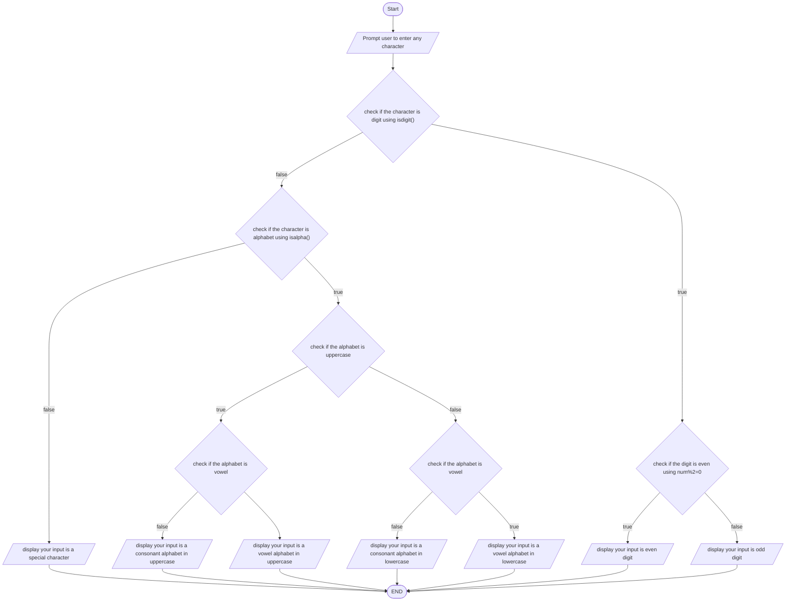

# problem Analysis
Input: any character from the keybord
process: check if the character is even digit, odd digit, vowel alphaber, consonant alphabet or special character
output: Type of the character
# Flow Chart

# Pseudo code

