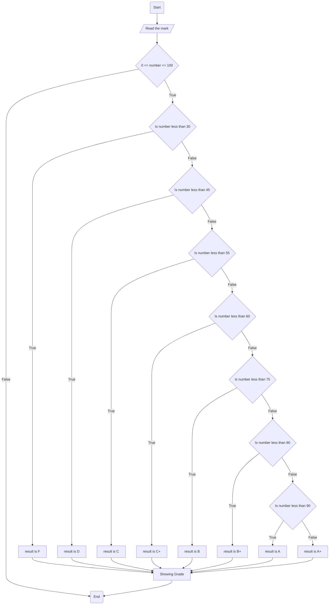

# Problem Analysis
1. Input : Test 15%,  Quiz 5%, Project 20%, Assignment 10%, Final exam 50%
2. Process: check if the inputs are with in the range allowed,
            calculate the total mark totalMark 100%  = test + quiz + assignment + finalExam +project
3. output: display the grade based on the total mark

# Flow Chart

# Psuedo code
1. start
2. calculate total mark
3. check if the mark is between 100 and 0
4. if false go to 20
5. if true, check if the number is less than 30
6. if true, print F and go to 20
7. if false; check if the number is less than 45
8. if true, print D and go to 20
9. if false; check if the number is less than 55
10. if true, print C and go to 20
11. if false; check if the number is less than 60
12. if true, print C+ and go to 20
13. if false; check if the number is less than 75
14. if true, print B and go to 20
15. if false; check if the number is less than 80
16. if true, print B+ and go to 20
17. if false; check if the number is less than 90
18. if true, print A and go to 20
19. otherwise print A+ and goto 20
20. end
