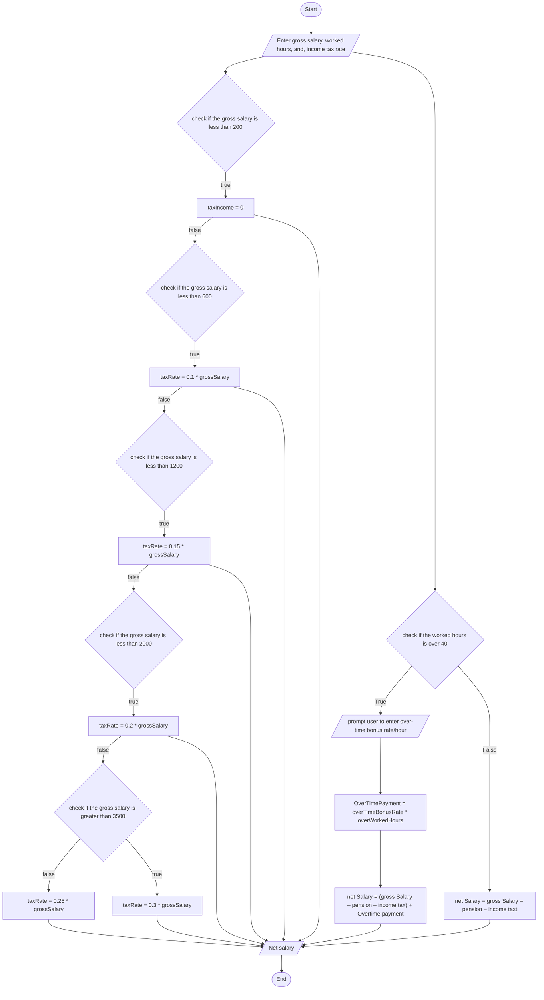

# problem analysis
1. Input: gross salary, worked hours, and, income tax rate, over-time bonus rate/hour
2. process: Calculate pension, income tax
            pension = gross salary * 7/100
            income tax = gross salary * tax rate
            Check if the employee worked hours exceed 40 hrs.
            Compute the bonus payment [optional]
            over worked hours * bonus rate
            Compute Net-Pay of an employee
           net Salary = (gross Salary – pension – income tax) + Overtime payment
# Flow Chart

# Pseudo code
1. start
2. prompt user to enter gross salary, worked hours, and, income tax rate
3. check if the gross salary is less than 200
4. if true calculate taxRate using taxRate = 0.1 * grossSalary
5. if false check if the gross salary is less than 1200
6. if true calculate taxRate using taxRate = 0.15 * grossSalary
7. if false check if the gross salary is less than 2000
8. if true calculate taxRate using taxRate = 0.2 * grossSalary
9. if false check if the gross salary is less than 3500
10. if true calculate taxRate using taxRate = 0.25 * grossSalary
11. if false calculate taxRate using taxRate = 0.3 * grossSalary
12. then check if the worked hours is over 40
13. if true prompt user to enter over-time bonus rate/hour and calculate overTimePayment using  overTimePayment = overTimeBonusRate * overWorkedHours
14. Calculate net Salary using netSalary= (gross Salary – pension – income tax) + Overtime payment
15. display net salary
16. end
17. 
