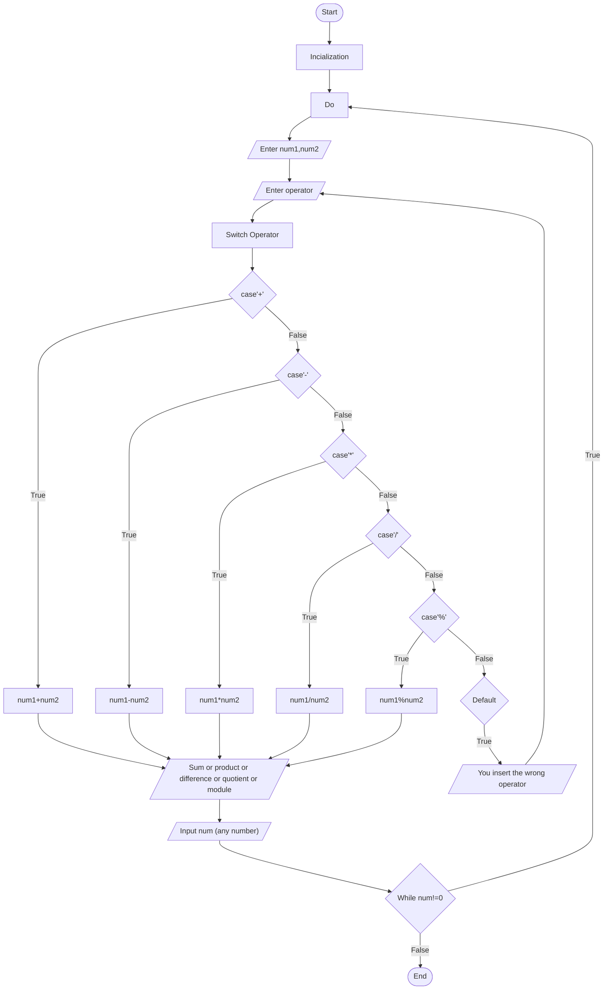

# Problem Analysis
Input: The number you want to calculate num1 and num2
       The type of operator
process: Sign Identification
         Arithmetic Operator
Output: Sum or product or difference or quotient or module
# Flowchart

# Pseudo Code
1. Start
2. Display "Enter the operation space separated (a + b or a - b): "
3. Read 'num1', 'sign', 'num2' from the user
4. Switch 'sign'
    1. Case '+': set 'result' to 'num1 + num2'
    2. Case '-': set 'result' to 'num1 - num2'
    3. Case '*': set 'result' to 'num1 * num2'
    4. Case '/': set 'result' to 'num1 / num2'
    5. Case '%': set 'result' to 'num1 % num2'
    6. Default: display "wrong sign please input +,-,*,%, or /"
5. Display 'num1', 'sign', 'num2', "=", 'result'
6. Display "Please enter 0 to terminate the program or any number to continue: "
7. Read 'num' from the user
8. If 'num' is not equal to 0, go back to step 2
9. End

