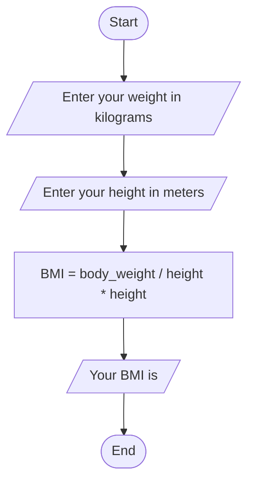

# Problem Analysis
    1. input: Prompt the user to enter the weight and to enter the height of the person.
    2. process: Calculate the Body Mass Index (BMI) using the formula: BMI = (weight / (height * height)
    3. output: The program displays the calculated Body Mass Index.

# Algorithm Design (pseudo code)
    1. start
    2. Prompt user for input: "Enter your weight in kilograms "
    3. Read user input and store it in the variable body_weight
    4. Prompt user for input: "Enter your height in meters "
    5. Read user input and store it in the variable height
    6. Calculate BMI using the formula: BMI = body_weight / (height * height)
    7. Display "Your BMI is " followed by the calculated BMI
    8. End program
# flowchart

