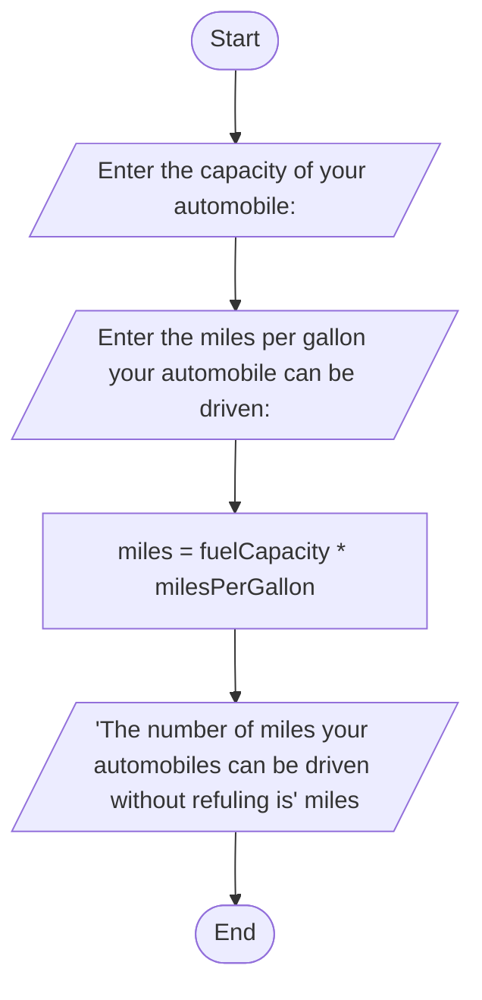

# Problem Analysis
   1) input:Prompt the user to enter the fuel tank capacity in gallons and the miles per gallon the automobile can be driven().
   2) process:Calculate the number of miles the automobile can be driven without refueling using the formula  miles =(fuelCapacity * milesPerGallon)
   3) output: Display the number of miles the automobile can be driven without refuelling

# Algorithm Design(pseudo code)
   1) start
   2) Prompt user for input: "Enter the capacity of your automobile: "
   3) Read user input and store it in the variable fuelCapacity
   4) Prompt user for input: "Enter the miles per gallon your automobile can be driven: "
   5) Read user input and store it in the variable milesPerGallon
   6) Calculate miles using the formula: miles = fuelCapacity * milesPerGallon
   7) Display "The number of miles your automobiles can be driven without refuling is ." followed by the calculated miles
# Flowchart

