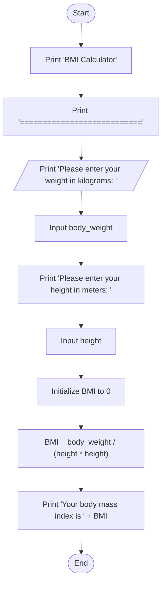

This Program Is used To Calculate A person's Body Mass Index.

                    Analysis

Input:
The user is prompted to enter their weight in kilograms.
The user is prompted to enter their height in meters.

Process:
The program calculates the Body Mass Index (BMI) using the formula: BMI = weight / (height * height).

Output:
The program displays the calculated Body Mass Index.

                      Algorithm Design (Pseudocode)
1. Display "BMI Calculator" title
2. Display "===========================" separator
3. Prompt user for input: "Please enter your weight in kilograms: "
4. Read user input and store it in the variable body_weight
5. Prompt user for input: "Please enter your height in meters: "
6. Read user input and store it in the variable height
7. Calculate BMI using the formula: BMI = body_weight / (height * height)
8. Display "Your body mass index is " followed by the calculated BMI
9. End program

                      #Flow chart

                     
