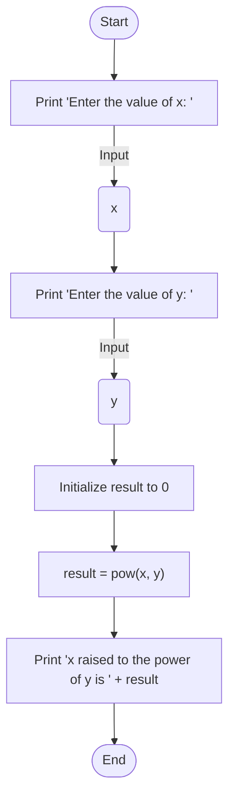

This program calculates the result of raising a given number (x) to a specified power (y).

                                 Analysis

Input:
The user is prompted to enter the value of x.
The user is prompted to enter the value of y.

Process:
The program calculates x raised to the power of y using the pow() function from the <cmath> library.

Output:
The program displays the result of the calculation, showing x raised to the power of y.

                                 Algorithm Design (pseudocode)
1. Display "Enter the value of x: " prompt
2. Read user input and store it in the variable x
3. Display "Enter the value of y: " prompt
4. Read user input and store it in the variable y
5. Calculate result using the formula: result = pow(x, y)
6. Display x, " raised to the power of ", y, " is ", and the calculated result
7. End program
                                Flowcahrt

