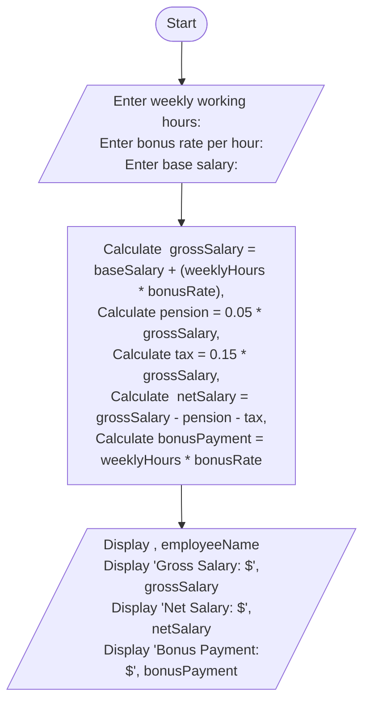

**Problem Analysis:**

The program needs to calculate the net pay of an employee based on their gross salary, worked hours, income tax rate, pension rate, and overtime bonus rate. 

It should also account for different tax rates based on the gross salary.

**Pseudocode**

Start

Input grossSalary, workedHours, taxRate, pensionRate, overtimeRate

pension = grossSalary * (pensionRate / 100)

if grossSalary <= 200
    incomeTax = 0
else if grossSalary > 200 and grossSalary <= 600
    incomeTax = grossSalary * 0.1
else if grossSalary > 600 and grossSalary <= 1200
    incomeTax = grossSalary * 0.15
else if grossSalary > 1200 and grossSalary <= 2000
    incomeTax = grossSalary * 0.20
else if grossSalary > 2000 and grossSalary <= 3500
    incomeTax = grossSalary * 0.25
else if grossSalary > 3500
    incomeTax = grossSalary * 0.30

if workedHours > 40
    Input overtimeRate
    overtimePayment = (workedHours - 40) * overtimeRate
    netSalary = grossSalary - pension - incomeTax + overtimePayment
else
    netSalary = grossSalary - pension - incomeTax

Output netSalary

End
**Flowchart**

