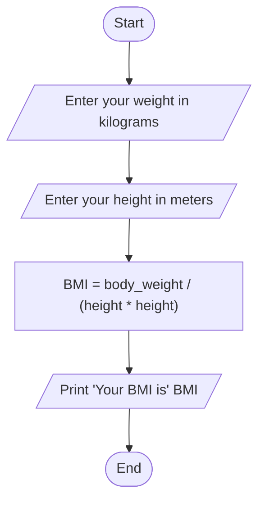

A.)Problem Analysis:
 
  The problem requires the development of a program in C++ that calculates the Body Mass Index (BMI) of a user given their weight in kilograms and height in meters. 
  
  The BMI is calculated using the formula:  BMI= weight/(height*height)

Input:
  Weight in kilograms
  Height in meters
  Output:
  BMI value 
  
B.)Algorithm Design:
  1. Start: The program begins.
  2. Input weight in kilograms (weight)
  3. Input height in meters (height)
  4. Calculate BMI using the formula: 
                              BMI= weight/(height*height)
  5. Display the calculated BMI
  6. End
     
#Flowchart

 

