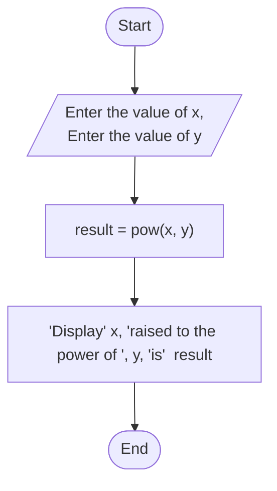

A.) Problem Analysis:
   The problem requires creating a program that calculates the result of the expression `x^y`, where the values of `x` and `y` are provided by the user. Below is the problem analysis in detail:

 Input:
   - Prompt the user to enter the value of `x`.
   - Prompt the user to enter the value of `y`.
   - Read and store the values entered by the user into variables `x` and `y`.

 Calculation:
   - Calculate the result of `x` raised to the power of `y` (`x^y`).
   - Use loops or built-in functions (like `pow()` in C++) to perform the exponentiation calculation.

 Output:
   - Display the calculated result of `x^y` to the user.
B.) Aligorithm Design:

1. **Start**
2. Prompt the user to enter the value of `x`.
3. Read and store the value entered by the user into variable `x`.
4. Prompt the user to enter the value of `y`.
5. Read and store the value entered by the user into variable `y`.
6. Calculate the result of `x` raised to the power of `y`.
7. Display the calculated result of `x^y` to the user.
8. **End**

#Flowchart

