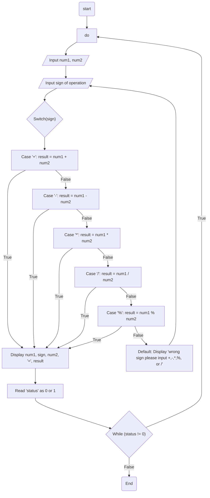

## Problem Analysis
    Input: Two numbers and arthimetic operator
    Process : perfomring the intended arithemetic operation
    Output : Display the result

## Pseudocode
    1. Start
    2. Display "Enter the operation space separated (a + b or a - b): "
    3. Read 'num1', 'sign', 'num2' from the user
    4. Switch 'sign'
        a. Case '+': set 'result' to 'num1 + num2'
        b. Case '-': set 'result' to 'num1 - num2'
        c. Case '*': set 'result' to 'num1 * num2'
        d. Case '/': set 'result' to 'num1 / num2'
        e. Case '%': set 'result' to 'num1 % num2'
        f. Default: display "wrong sign please input +,-,*,%, or /"
    5. Display 'num1', 'sign', 'num2', "=", 'result'
    6. Display "Please enter 0 to terminate the program or 1 to continue: "
    7. Read 'status' from the user
    8. If 'status' is not equal to 0, go back to step 2
    9. End

## Flowchart

