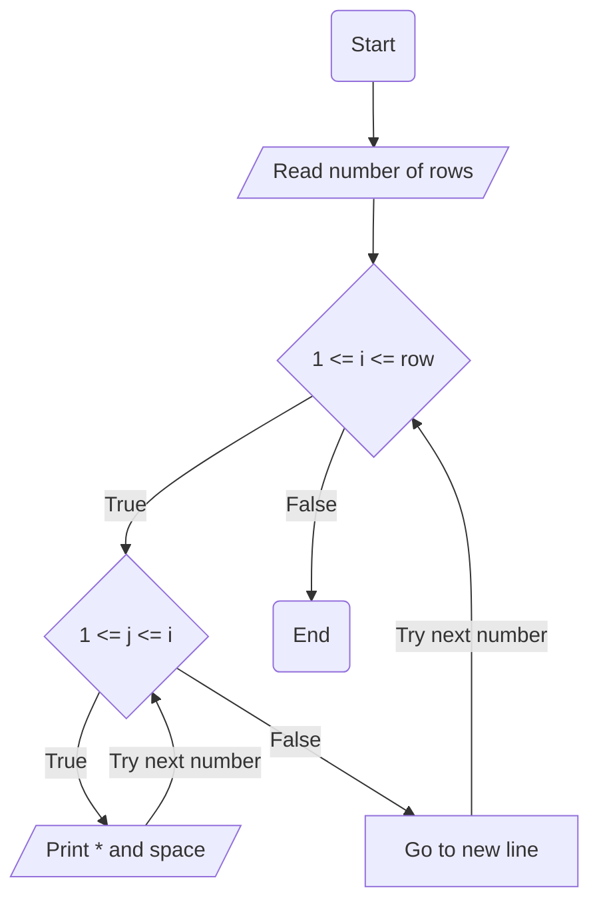

Half-Pyramid
## Problem analysis
    Input: Get the number of rows from the user
    Process: Have stars less than or equal to row for each row
    Output: Display the pattern

## Pseudocode
    1. Start
    2. Read the number of rows from the user
    3. For i from 1 to row both inclusive
      a. For j from 1 to i both inclusive
        I. Display * and space
      b. Goto new line
    4. End
## Flowchart

