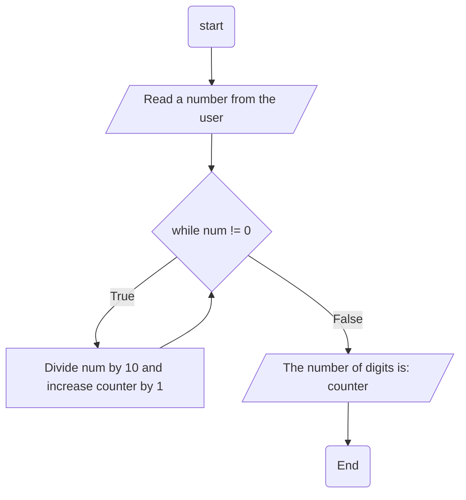

## Problem Analysis:
    Input: A number
    Process: Counting the number of digits using iteration
    Output: The number of digits

## Pseudocode
    1. Get a number from the user;
    2. While (number is not 0)
      a. Do Divide the number by 10 and
      b. increase our counter by 1
    3. end while
    4. display the number of digits using our counter

## Flowchart

