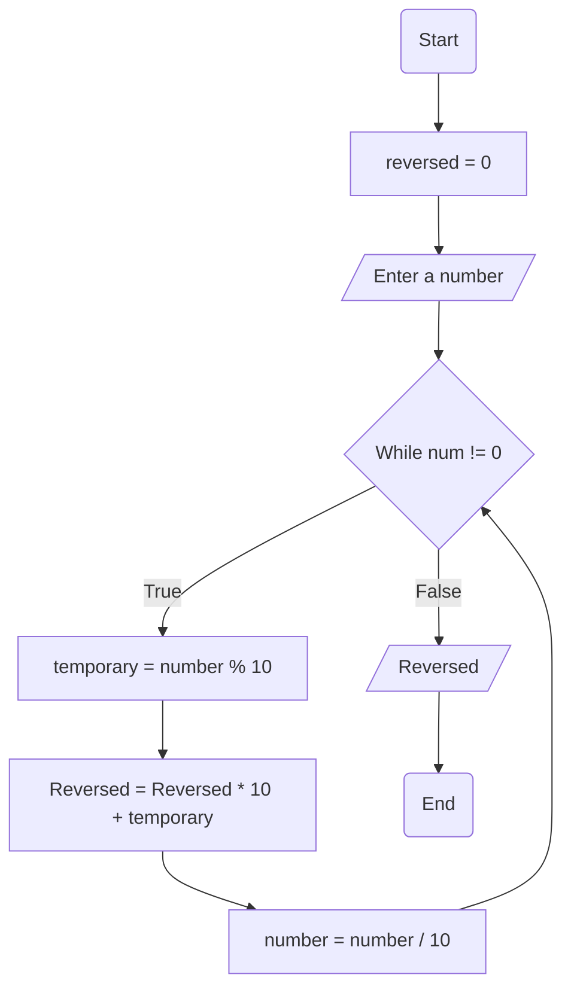

## Problem Analysis
    Input: Read a number from the user
    Process: Calculate reverse using modulo, multiplication, and addition
    Output: Display the reversed number

## Pseudocode
    1. Start
    2. Initiate reversed as 0
    3. Read the number from the user
    4. While the number is not equal to 0
      a. Assign a temporary number as the number modulo 10
      b. Multiply reversed by 10 and the temporary number
      c. Set number to be number divided by 10
    5. Display reversed value
    6. End

## Flowchart

