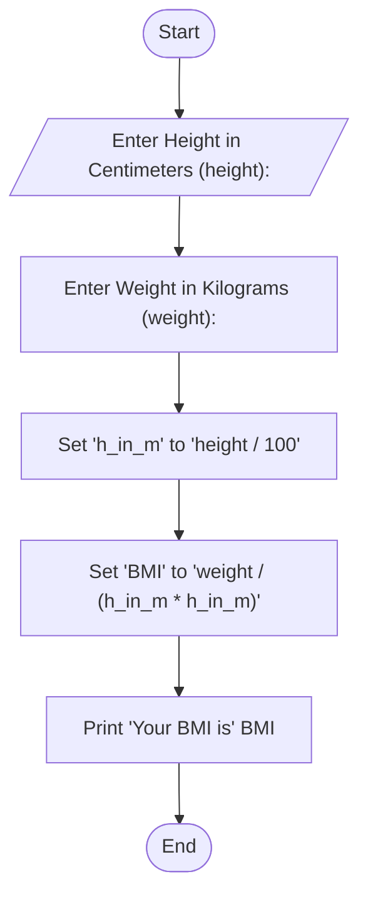

## BMI Calculator

#### Problem Analysis
This program aims to calculate the Body Mass Index (BMI) based on user-provided values for height and weight. The program begins by prompting the user to input their height in centimeters and weight in kilograms. It then converts the height from centimeters to meters using the conversion factor of 1 meter equals 100 centimeters. The BMI is calculated using the formula BMI = weight / (height * height), where height is in meters. The resulting BMI is displayed to the user.
  
#### Algorithm

    1. Start
    2. Display "Enter Height in Centimeters (height): "
    3. Read 'height' from the user
    4. Display "Enter Weight in Kilograms (weight): "
    5. Read 'weight' from the user
    6. Set 'h_in_m' to 'height / 100'
    7. Set 'BMI' to 'weight / (h_in_m * h_in_m)'
    8. Display "Your BMI is: BMI"
    9. End

#### Flowchart

