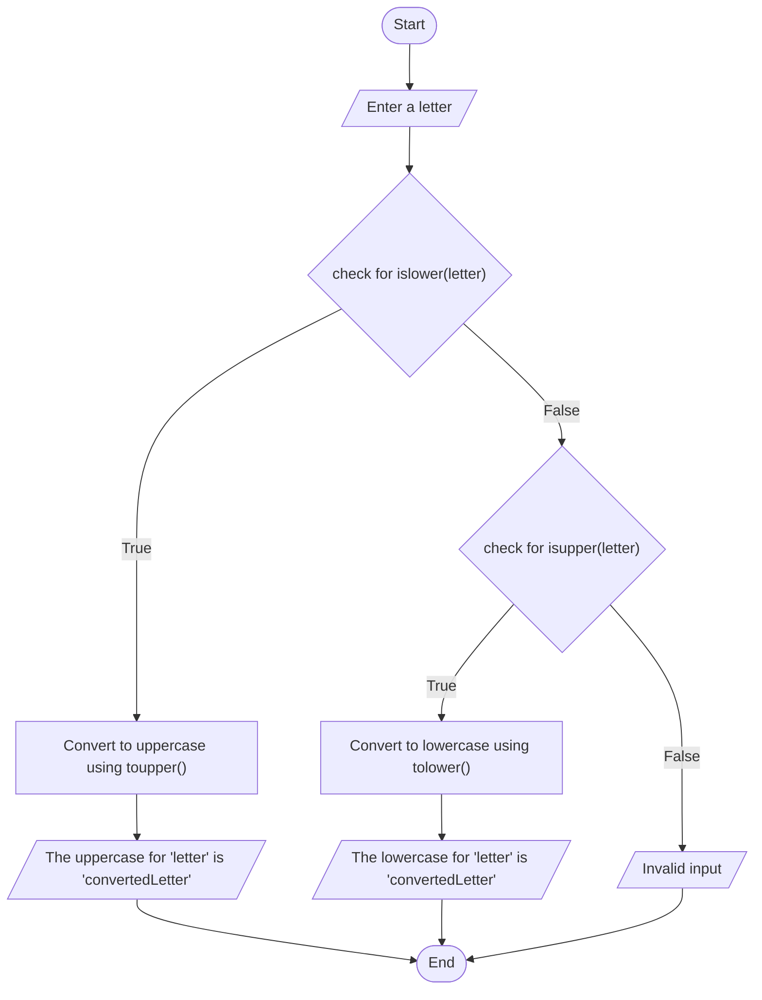

## Case Converter

#### Problem Analysis

This program takes a single letter as user input and determines whether it is in uppercase or lowercase. Depending on the case, it then converts the letter to its counterpart and displays the result. The program utilizes the <cctype> header for the islower() and isupper() functions to check the case of the letter and toupper () and tolower() functions for case conversion. The output messages clearly inform the user about the case conversion result, and an "Invalid input" message is displayed if the entered character is not a letter.

#### Algorithm

     1. Start
     2. Display "Enter a letter: "
     3. Read 'letter' from the user
     4. Check if 'letter' is in lowercase using islower():
         a. If true, convert 'letter' to uppercase using toupper()
           i. Display "The uppercase for 'letter' is 'convertedLetter'"
     5. Check if 'letter' is in uppercase using isupper():
         b. If true, convert 'letter' to lowercase using tolower()
           i. Display "The lowercase for 'letter' is 'convertedLetter'"
     6. If 'letter' is neither lowercase nor uppercase:
         a. Display "Invalid input"
     7. End

#### FlowChart

