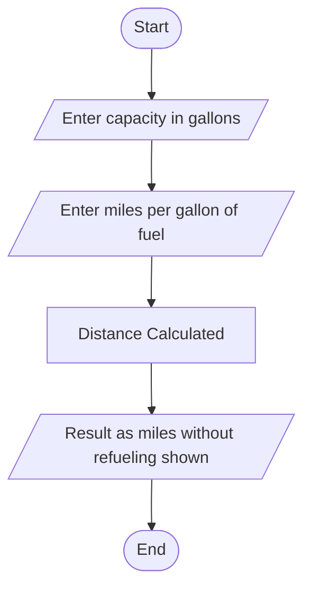

## Number of Miles without refueling

#### Problem Analysis

This program aims to calculate and display the distance an automobile can travel without refueling based on user-provided inputs, including the fuel tank capacity in gallons and the number of miles the automobile can travel per gallon of fuel. The program prompts the user to enter these values, performs a simple multiplication to calculate the total distance, and then outputs the result.

#### Algorithm

    1. Start
    2. Declare variables: capacity (float), miles_per_gallon (float), distance (float)
    3. Display "Enter the capacity in gallons of the fuel tank: "
    4. Read 'capacity' from the user
    5. Display "Enter the number of miles the automobile can be driven per gallon of fuel: "
    6. Read 'miles_per_gallon' from the user
    7. Calculate 'distance' as 'capacity * miles_per_gallon'
    8. Display "Your automobile can be driven ", 'distance', " miles without refueling"
    9. End

#### Flowchart

