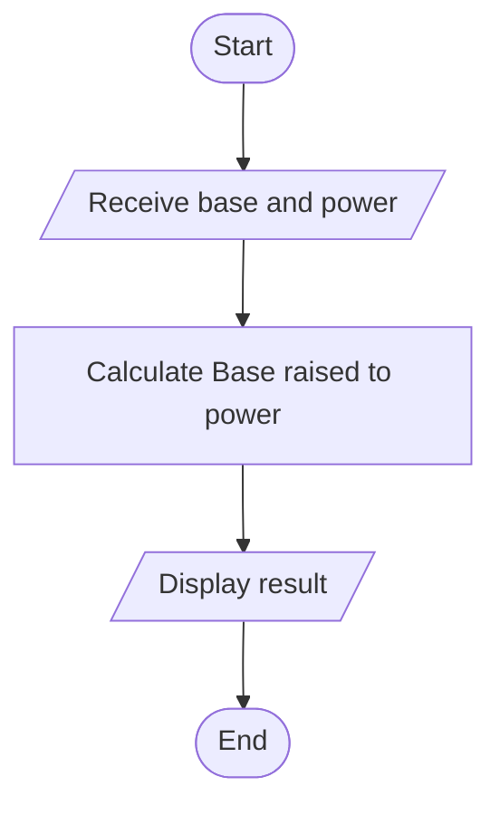

## X the power of Y calculator

#### Problem Analysis

This program calculates the result of raising a given base to a specified power. The user is prompted to input the base and power, and the program utilizes the pow() function from the <cmath> header to perform the exponentiation. The result is then displayed to the user. The program is concise and provides a quick means of computing exponentiation for arbitrary input values.

#### Algorithm

    1. Start
    2. Declare variables: base (float), power (float), result (float)
    3. Display "Enter the base: "
    4. Read 'base' from the user
    5. Display "Enter the power: "
    6. Read 'power' from the user
    7. Calculate 'result' as 'pow(base, power)'
    8. Display 'base', " raised to the power of ", 'power', " is ", 'result'
    9. End

#### FlowChart

